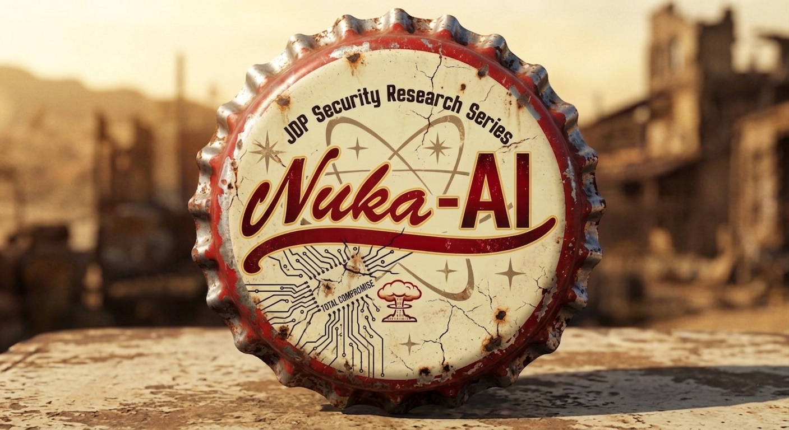
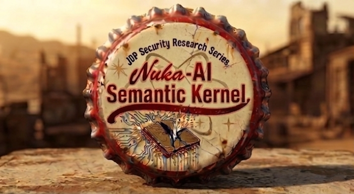
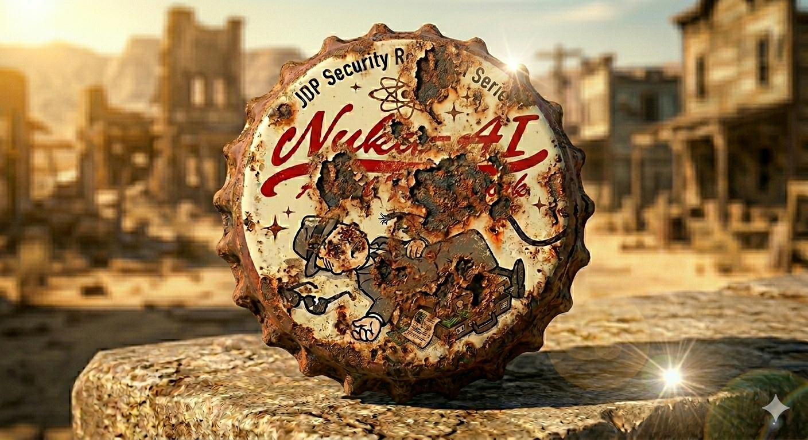
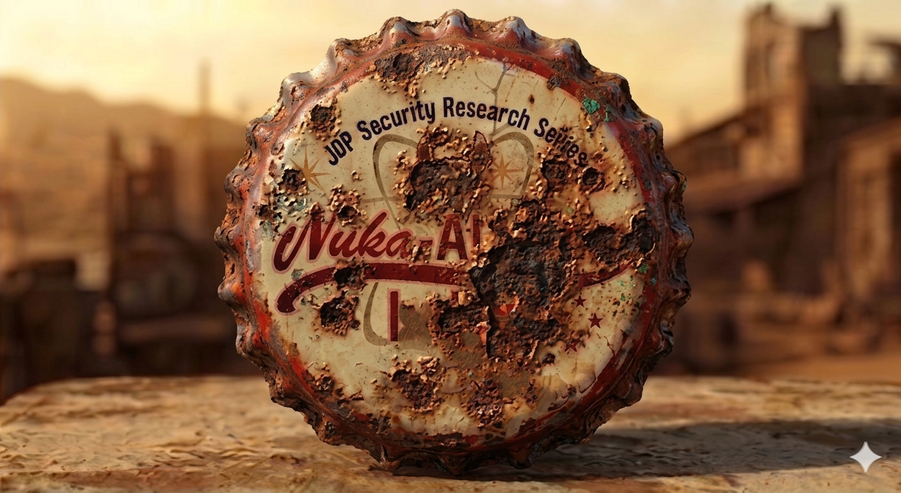
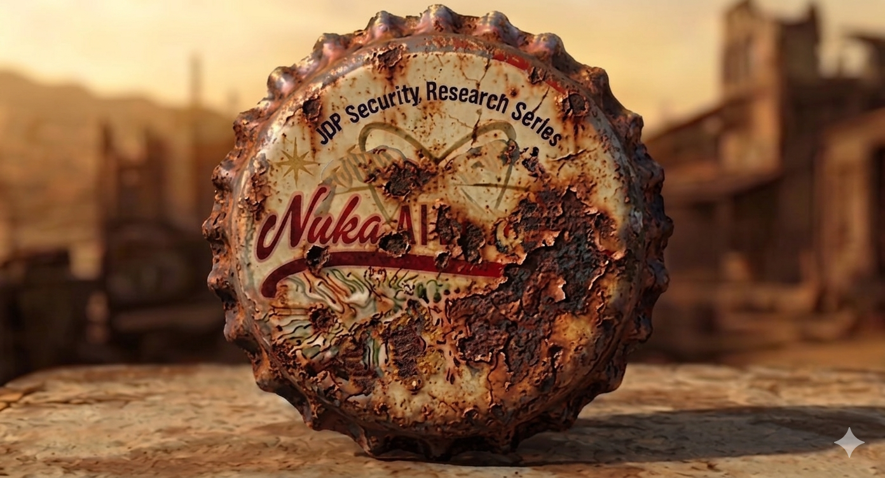
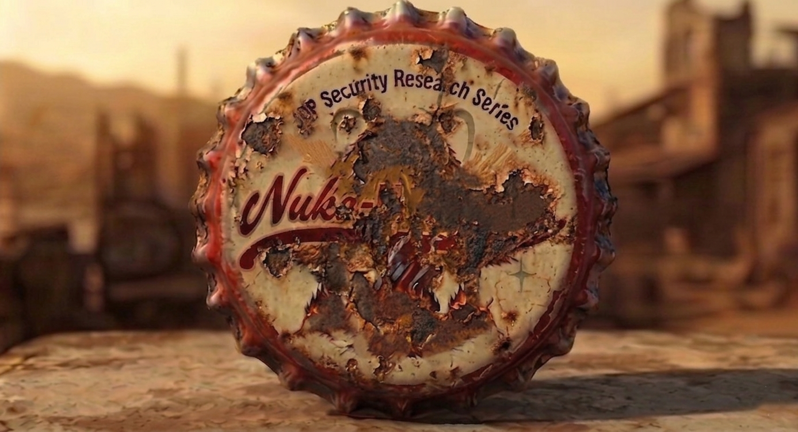

---
hide:
  - navigation
---

# Nuka-AI: AI Orchestration Research Series

## Investigating Security Trust Gaps in AI Frameworks

Welcome to the central research hub for the **Nuka-AI Research Series**. This initiative, led by **JDP Security**, focuses on identifying architectural trust gaps and critical persistence vectors in modern AI ecosystems.

---

### Active Research Tracks

| | |
| :--- | :--- |
|  | **Case File 01: The Cracked Kernel - The Abstraction Leak**   **Status:** [**PUBLIC DISCLOSURE RELEASED**]   **CVSS:** `10.0 (CRITICAL)`   **Vector:** `AV:N/AC:L/PR:N/UI:N/S:C/C:H/I:H/A:H`   **Target:** Microsoft Semantic Kernel (.NET) v1.47.0 – v1.74.0    This research documents a catastrophic "Trust Gap" in the AI orchestration layer. I demonstrate how the framework's reliance on non-deterministic LLM output creates a direct conduit for **Unauthenticated Remote Code Execution (RCE)** through **insecure tool invocation**.    By feeding crafted inputs that manipulate the agent's planning phase, an attacker can hijack the orchestration pipeline to force arbitrary function execution. Exploiting **Type Confusion** and **Late Canonicalization** during these rogue tool invocations, I have identified six independent Zero-Day bypasses that completely invalidate Microsoft’s official remediation for **CVE-2026-25592**.    These findings prove that even "hardened" versions of the kernel remain vulnerable to a total host takeover. By chaining these invocation bypasses, an attacker can trigger the **"Self-Nuke" vector** - forcing the agent to weaponize its own internal tools to overwrite the host application's source code.    **Forensic Evidence & White Paper**   The full technical breakdown, including the **Exploit Harness**, forensic **.cast recordings**, and the mandatory **NukaSecurityFilter** remediation, is now live.    👉 **[READ THE FULL DISCLOSURE: NUKA-AI-2026-001](https://nuka-ai.github.io/posts/2026-07-28-Semantic-Kernel-disclosure/)** |
|  | **Case File 02: Agent Down - The Containment Breach**   **Status:** `[AWAITING RESPONSIBLE DISCLOSURE]`   **CVSS:** `10.0 (CRITICAL)`   **Vector:** `AV:N/AC:L/PR:N/UI:N/S:C/C:H/I:H/A:H`   **Target:** Microsoft Agent Framework   **Justification:** Identified architectural flaw in containerized agent orchestration allowing for full host-level escape via manipulated execution contexts. |
|  | **Case File 03: The Index Collapse** Status: `[AWAITING RESPONSIBLE DISCLOSURE]` **CVSS:** `10.0 (CRITICAL)` **Vector:** `AV:N/AC:L/PR:N/UI:N/S:C/C:H/I:H/A:H` **Target:** LlamaIndex **Justification:** By manipulating orchestration state, an attacker can force a full system compromise. |
|  | **Case File 04: The Broken Link** Status: `[AWAITING RESPONSIBLE DISCLOSURE]` **CVSS:** `10.0 (CRITICAL)` **Vector:** `AV:N/AC:L/PR:N/UI:N/S:C/C:H/I:H/A:H` **Target:** Langchain **Justification:** Design flaw in the framework trust model permitting remote hijacking of supply chain logic. |
|  | **Case File 05: The Ghost in the Haystack** Status: `[AWAITING RESPONSIBLE DISCLOSURE]` **CVSS:** `10.0 (CRITICAL)` **Vector:** `AV:N/AC:L/PR:N/UI:N/S:C/C:H/I:H/A:H` **Target:** Deepset Haystack **Justification:** Terminal event. Full-spectrum host compromise with zero forensic footprint. |

---

### 📅 April/May 2026 Disclosure Timeline
Technical white papers currently held in **Secure Storage**. 

* **April 28, 2026:** [Case File 01: The Cracked Kernel The Abstraction Leak (RCE Bypass)](posts/2026-07-14-initial-disclosure.md) `[ACTIVE]` **CVSS:** `10.0 (CRITICAL)`
* **May 5, 2026:** Case File 02 - Agent Down The Containment Breach `[LOCKED]` **CVSS:** `10.0 (CRITICAL)`
* **May 12, 2026:** Case File 03 - The Index Collapse `[LOCKED]` **CVSS:** `10.0 (CRITICAL)`
* **May 19, 2026:** Case File 04 - The Broken Link `[LOCKED]` **CVSS:** `10.0 (CRITICAL)`
* **May 26, 2026:** Case File 05 - The Ghost in the Haystack `[LOCKED]` **CVSS:** `10.0 (CRITICAL)`
* **June 5, 2026:** **Industry Retrospective: The Fallout `[Ecosystem Post-Mortem]`

---

**Inquiries:** [JDP.sec@proton.me](mailto:JDP.sec@proton.me) | [Nuka.AI@proton.me](mailto:Nuka.AI@proton.me)
